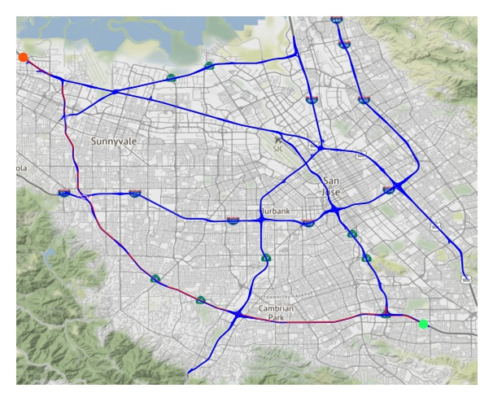

# [Reproducibility Project] InfoBAX for Graph Shortest Paths

    
    
         

This repo provides an implementation of the InfoBAX ([Neiswenger et al.](https://arxiv.org/abs/2104.09460)) featuring some additional experiments and benchmarks.

There are many real world problems that can be viewed as estimating an unknown property of a black-box function. For example, estimating the shortest path between different locations or finding the global maximum of the function. As a result of tackling this problem, the InfoBAX procedure occured.

In a few words, InfoBAX is the procedure that sequentially finds the most effective requests to the black-box function in order to evaluate some of its computable properties. In this work we are interested in estimating the shortest path in graphs, where the edges have costs given by an unknown function. For modeling such a function we define Gaussian processes on $\mathbb{R}^n$ or directly on the edges of the graph.

The original paper is

>Bayesian Algorithm Execution: Estimating Computable Properties of Black-box Functions Using Mutual Information
>
>Willie Neiswanger, Ke Alexander Wang, Stefano Ermon
>
>International Conference on Machine Learning (ICML), 2021
>
>[arXiv:2104.09460](https://arxiv.org/abs/2104.09460)

## Installation
To install the package along with all of its dependencies

`pip instal git+https://github.com/angelinagnedina/BAX_realization.git`

## Usage
The example of how to use infoBAX procedure can be found in examples folder in **InfoBAX_on_grid-shaped_graph** notebook. There is an example for grid-shaped graph, but the procedure can be implemented on various graphs, for example, on road graph from PEMS dataset. 

The way to get a visualization for a grid-shaped graph can also be found in that notebook, you can either get a one image, or a few to make a gif such as the following:

There you may also find a procedure to compare different strategies for finding new positions to request to black-box function. An example of such comparison is given in two plots at the beginning of the README file.
